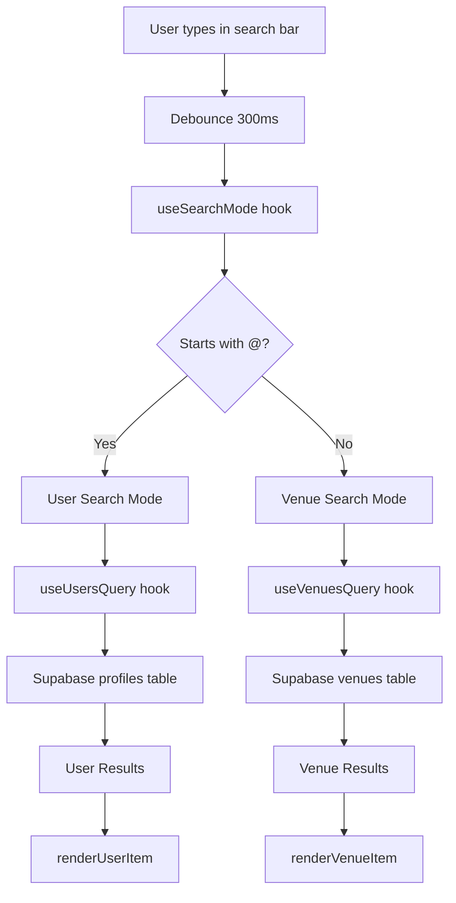

# @ Search Feature Documentation

## Overview

The @ Search Feature enables users to search for other users within the app by typing `@` followed by a username or display name. This feature seamlessly integrates with the existing venue search functionality, providing a unified search experience with automatic mode detection.

## Table of Contents

1. [User Guide](#user-guide)
2. [Username System](#username-system)
3. [Search Modes](#search-modes)
4. [Technical Architecture](#technical-architecture)
5. [API Reference](#api-reference)
6. [Database Schema](#database-schema)
7. [Security & Privacy](#security--privacy)
8. [Testing](#testing)

---

## User Guide

### How to Search for Users

1. Navigate to the Search screen
2. Tap the search bar
3. Type `@` followed by the username or display name you're looking for
4. Results will appear as you type (after 2+ characters)
5. Tap any user to view their profile

### Search Examples

| Input | Result |
|-------|--------|
| `@john_doe` | Searches for users with username or display name matching "john_doe" |
| `@sarah` | Searches for users with username or display name matching "sarah" |
| `@user_123` | Searches for users with username or display name matching "user_123" |
| `coffee shop` | Searches for venues (no @ prefix = venue search) |

### Search Tips

- **Minimum 2 characters**: You need to type at least 2 characters after `@` to see results
- **Case doesn't matter**: Search is case-insensitive (`@John` = `@john`)
- **Partial matches**: You don't need to type the full username
- **Up to 20 results**: Search returns a maximum of 20 matching users
- **Real-time results**: Results update as you type (with 300ms debounce)

---

## Username System

### Username Requirements

Usernames must follow these strict rules:

| Rule | Description | Example |
|------|-------------|---------|
| **Length** | 3-30 characters | ✅ `john_doe` (8 chars)<br>❌ `ab` (too short)<br>❌ `this_is_a_very_long_username_that_exceeds_limit` (too long) |
| **Characters** | Lowercase letters (a-z), numbers (0-9), underscores (_) | ✅ `user_123`<br>❌ `User-123` (uppercase and hyphen)<br>❌ `user@123` (special character) |
| **Format** | Must match regex: `^[a-z0-9_]{3,30}$` | ✅ `john_doe_123`<br>❌ `John_Doe` (uppercase)<br>❌ `john doe` (space) |
| **Uniqueness** | Must be unique across all users | ✅ First user with `john_doe`<br>❌ Second user trying `john_doe` |
| **Storage** | Always stored in lowercase | Input: `JohnDoe` → Stored: `johndoe` |

### Display Name vs Username

The app uses two fields for user identification:

- **Username**: Unique identifier, lowercase, alphanumeric + underscore
  - Used for search and unique identification
  - Always shown with `@` prefix in UI
  - Example: `@john_doe`

- **Display Name**: User-friendly name, can include spaces and mixed case
  - Used as primary display in UI
  - Can be changed without affecting username
  - Example: `John Doe`

### Display Priority

When showing user information, the app follows this priority:

1. **Display Name** (if set) → shown as primary text
2. **Username** (if display name not set) → shown as primary text
3. **Name** (if neither set) → fallback

The username is always shown as secondary text when display name is present.

**Example Display:**
```
John Doe          ← Display Name (primary)
@john_doe         ← Username (secondary)
```

---

## Search Modes

The search screen operates in two distinct modes based on the search query:

### Venue Search Mode (Default)

**Trigger**: Any search query that doesn't start with `@`

**Features**:
- Searches venues by name, category, location, description
- Supports filters (categories, price ranges, trending)
- Shows venue cards with ratings, images, and details
- Results sorted by rating (highest first)

**Example Queries**:
- `coffee shop`
- `downtown`
- `fine dining`

### User Search Mode (@ Prefix)

**Trigger**: Search query starts with `@`

**Features**:
- Searches users by username and display name
- Shows user avatars, display names, and usernames
- Case-insensitive matching
- Up to 20 results
- Minimum 2 characters required

**Example Queries**:
- `@john`
- `@sarah_smith`
- `@user123`

### Mode Switching

The search mode switches automatically based on the presence of the `@` prefix:

```
User types: "coffee"     → Venue Search Mode
User types: "@"          → User Search Mode (no results yet)
User types: "@jo"        → User Search Mode (shows results)
User deletes "@"         → Venue Search Mode
```

### Mode Indicator

A visual indicator shows the current search mode:
- 🏢 "Searching venues" (venue mode)
- 👤 "Searching users" (user mode)

---

## Technical Architecture

### Component Hierarchy

```
SearchScreen
├── SearchBar (with mode detection)
├── ModeIndicator (shows current mode)
├── FilterDrawer (venue search only)
├── ResultsList
│   ├── VenueResultItem (when mode = venue)
│   └── UserResultItem (when mode = user)
└── EmptyState (mode-specific messages)
```

### Data Flow



### Key Hooks

#### useSearchMode

Detects search mode and cleans the query.

```typescript
const { mode, cleanQuery } = useSearchMode(searchQuery);
// mode: 'user' | 'venue'
// cleanQuery: query with @ removed (if present)
```

**Implementation**:
- Checks if query starts with `@`
- Returns mode and cleaned query
- Memoized to prevent unnecessary recalculations

#### useUsersQuery

Fetches users matching the search query.

```typescript
const { data, isLoading, error } = useUsersQuery({
  searchQuery: cleanQuery,
  enabled: mode === 'user',
});
```

**Features**:
- Searches username and display_name fields
- Case-insensitive matching using `ilike`
- Filters out users without usernames
- Limits results to 20 users
- 30-second stale time for caching

#### useDebounce

Delays search execution to optimize performance.

```typescript
const debouncedQuery = useDebounce(searchQuery, 300);
```

**Benefits**:
- Reduces API calls
- Improves performance
- Better user experience

### Validation

#### validateUsername Function

Validates username format before storage.

```typescript
import { validateUsername } from '@/utils/usernameValidation';

const result = validateUsername('john_doe');
if (!result.isValid) {
  console.error(result.error);
}
```

**Validation Rules**:
1. Not empty
2. Length 3-30 characters
3. Only lowercase letters, numbers, underscores
4. Matches regex: `^[a-z0-9_]{3,30}$`

**Error Types**:
- `REQUIRED`: Username is empty
- `TOO_SHORT`: Less than 3 characters
- `TOO_LONG`: More than 30 characters
- `INVALID_CHARACTERS`: Contains invalid characters

#### normalizeUsername Function

Converts username to lowercase for storage.

```typescript
import { normalizeUsername } from '@/utils/usernameValidation';

const normalized = normalizeUsername('JohnDoe');
console.log(normalized); // 'johndoe'
```

---

## API Reference

### User Search Query

**Endpoint**: Supabase `profiles` table

**Query**:
```typescript
supabase
  .from('profiles')
  .select('id, username, display_name, avatar_url')
  .or(`username.ilike.%${searchQuery}%,display_name.ilike.%${searchQuery}%`)
  .not('username', 'is', null)
  .limit(20)
```

**Parameters**:
- `searchQuery`: Search term (minimum 2 characters)

**Returns**:
```typescript
type UserSearchResult = {
  id: string;
  username: string;
  display_name: string | null;
  avatar_url: string | null;
};
```

**Features**:
- Multi-field search (username and display_name)
- Case-insensitive matching
- Filters out users without usernames
- Limited to 20 results

### Display Name Utility

**Function**: `getDisplayName`

**Usage**:
```typescript
import { getDisplayName } from '@/utils/displayName';

const displayName = getDisplayName(user);
```

**Logic**:
1. If `display_name` exists → return `display_name`
2. Else if `username` exists → return `username`
3. Else if `name` exists → return `name`
4. Else → return `'Anonymous'`

---

## Database Schema

### Profiles Table Updates

```sql
-- Add username and display_name columns
ALTER TABLE profiles 
ADD COLUMN username VARCHAR(30) UNIQUE,
ADD COLUMN display_name VARCHAR(100);

-- Add constraints
ALTER TABLE profiles
ADD CONSTRAINT username_format CHECK (
  username ~ '^[a-z0-9_]{3,30}$'
);

-- Create indexes for search performance
CREATE INDEX idx_profiles_username ON profiles(username);
CREATE INDEX idx_profiles_display_name ON profiles 
  USING gin(to_tsvector('english', display_name));

-- Add trigger to enforce lowercase username
CREATE OR REPLACE FUNCTION enforce_lowercase_username()
RETURNS TRIGGER AS $$
BEGIN
  IF NEW.username IS NOT NULL THEN
    NEW.username = LOWER(NEW.username);
  END IF;
  RETURN NEW;
END;
$$ LANGUAGE plpgsql;

CREATE TRIGGER trigger_enforce_lowercase_username
  BEFORE INSERT OR UPDATE ON profiles
  FOR EACH ROW
  EXECUTE FUNCTION enforce_lowercase_username();
```

### RLS Policies

```sql
-- Allow authenticated users to search profiles
CREATE POLICY "Authenticated users can search profiles"
ON profiles FOR SELECT
TO authenticated
USING (true);
```

**Security**:
- Only authenticated users can search
- Only public fields are exposed (id, username, display_name, avatar_url)
- Sensitive fields (email, phone) are never returned

---

## Security & Privacy

### Authentication

- **Required**: Users must be authenticated to search for other users
- **Enforcement**: RLS policies at database level
- **Fallback**: Unauthenticated users see empty results

### Data Exposure

**Exposed Fields** (safe for search results):
- `id` - User ID
- `username` - Username
- `display_name` - Display name
- `avatar_url` - Avatar image URL

**Protected Fields** (never exposed):
- `email` - Email address
- `phone` - Phone number
- `preferences` - User preferences
- Any other sensitive data

### Row Level Security (RLS)

All user search queries are protected by RLS policies:

```sql
-- Only authenticated users can search
CREATE POLICY "Authenticated users can search profiles"
ON profiles FOR SELECT
TO authenticated
USING (true);
```

### Error Handling

- Network errors show user-friendly messages
- Failed searches don't expose system details
- Invalid queries return empty results (not errors)

---

## Testing

### Data Validation Scripts

Before deploying the @ search feature or when investigating data quality issues, use the comprehensive validation script:

**Script**: `database/mockdata/check-at-search-data.sql`

**Purpose**: Validates data integrity and feature readiness for @ search

**What It Checks**:

1. **User Profile Completeness**
   - Users with/without usernames
   - Users with/without display names
   - Complete vs incomplete profiles

2. **Username Format Validation**
   - Invalid formats (uppercase, special characters)
   - Length violations (too short/long)
   - Duplicate usernames

3. **Display Name Quality**
   - Display names that look like usernames
   - Display names starting with @
   - Length distribution analysis

4. **Search Performance**
   - Index existence verification
   - Query performance testing (EXPLAIN ANALYZE)
   - GIN index validation

5. **Security & RLS**
   - RLS policy verification
   - Permission checks

6. **Feature Readiness**
   - Count of searchable users
   - Overall readiness status
   - Data quality recommendations

**How to Run**:

```bash
# Via Supabase SQL Editor
# Copy and paste the entire script

# Via psql
psql -h <host> -U <user> -d <database> -f database/mockdata/check-at-search-data.sql

# Via PowerShell (Windows)
.\database\mockdata\run-at-search-check.ps1
```

**Expected Output**:

The script runs 21 validation checks and provides:
- Summary report with feature readiness status
- Count of users with valid usernames
- List of data quality issues (if any)
- Sample search queries for manual testing
- Cleanup recommendations

**When to Run**:
- ✅ Before deploying to production
- ✅ After username/display_name migration
- ✅ When investigating search issues
- ✅ During data quality audits
- ✅ Before adding test users

**Related Scripts**:
- `quick-at-search-check.sql` - Quick validation (subset of checks)
- `test-at-search-now.sql` - Minimal test for immediate validation
- `run-at-search-check.ps1` - PowerShell wrapper for Windows

See [@ Search Validation Guide](../database/mockdata/README-AT-SEARCH-VALIDATION.md) for detailed documentation.

### Property-Based Tests

The feature includes property-based tests to verify correctness across all inputs:

**Property 1: Username Character Validation**
- Validates that invalid characters are rejected

**Property 2: Username Length Validation**
- Validates length constraints (3-30 characters)

**Property 3: Username Lowercase Transformation**
- Validates that usernames are stored in lowercase

**Property 8: Search Mode Detection**
- Validates mode detection based on @ prefix

**Property 9: Query Prefix Removal**
- Validates @ prefix removal for API calls

### Unit Tests

The feature includes unit tests for specific scenarios:

- Valid username examples
- Invalid username examples
- Mode detection with various inputs
- Navigation behavior
- Error handling

### Manual Testing Checklist

- [ ] Run data validation script (`check-at-search-data.sql`)
- [ ] Verify all validation checks pass
- [ ] Confirm searchable user count > 0
- [ ] Search for users with @ prefix
- [ ] Search for venues without @ prefix
- [ ] Switch between modes by adding/removing @
- [ ] Verify minimum 2 characters required
- [ ] Test with uppercase input (should work)
- [ ] Test with special characters (should be rejected)
- [ ] Test navigation to user profile
- [ ] Test with no results
- [ ] Test with network error
- [ ] Test with unauthenticated user
- [ ] Verify indexes exist for performance
- [ ] Check RLS policies are active

---

## Troubleshooting

### Common Issues

**Issue**: No results when searching users

**Solutions**:
- Ensure you're typing at least 2 characters after @
- Check that you're authenticated (logged in)
- Verify the username exists in the database
- Check network connection
- Run validation script to check data quality: `database/mockdata/check-at-search-data.sql`

---

**Issue**: Search is slow or laggy

**Solutions**:
- Debouncing is working (300ms delay is intentional)
- Check database indexes are created (run validation script)
- Verify network connection speed
- Check for console errors
- Review query performance with EXPLAIN ANALYZE

---

**Issue**: Username validation fails

**Solutions**:
- Ensure username is 3-30 characters
- Use only lowercase letters, numbers, and underscores
- Remove spaces and special characters
- Check that username isn't already taken
- Run validation script to find problematic usernames

---

**Issue**: Invalid usernames in database

**Solutions**:
- Run `check-at-search-data.sql` to identify invalid usernames
- Review "Data Cleanup Needed" section in validation output
- Create cleanup migration to fix invalid usernames
- Consider running lowercase trigger on existing data

---

## Future Enhancements

Potential improvements for future versions:

1. **Advanced Filters**
   - Filter by location
   - Filter by interests
   - Filter by mutual friends

2. **Search History**
   - Save recent searches
   - Suggest previous searches

3. **Fuzzy Matching**
   - Tolerate typos
   - Suggest similar usernames

4. **Search Analytics**
   - Track popular searches
   - Show trending users

5. **Block List Integration**
   - Hide blocked users from search
   - Respect privacy settings

---

## Related Documentation

- [Requirements Document](.kiro/specs/at-search-feature/requirements.md)
- [Design Document](.kiro/specs/at-search-feature/design.md)
- [Implementation Tasks](.kiro/specs/at-search-feature/tasks.md)
- [Backend Architecture](./BACKEND_ARCHITECTURE.md)
- [@ Search Validation Guide](../database/mockdata/README-AT-SEARCH-VALIDATION.md)
- [Validation Scripts Summary](../database/mockdata/VALIDATION-SCRIPTS-SUMMARY.md)
- [Main README](../README.md)

---

## Support

For questions or issues with the @ Search Feature:

1. Check this documentation
2. Review the design and requirements documents
3. Check the implementation tasks for technical details
4. Contact the development team

---

**Last Updated**: January 25, 2026
**Version**: 1.0.0
**Status**: ✅ Implemented
**Validation**: ✅ Comprehensive validation scripts available
